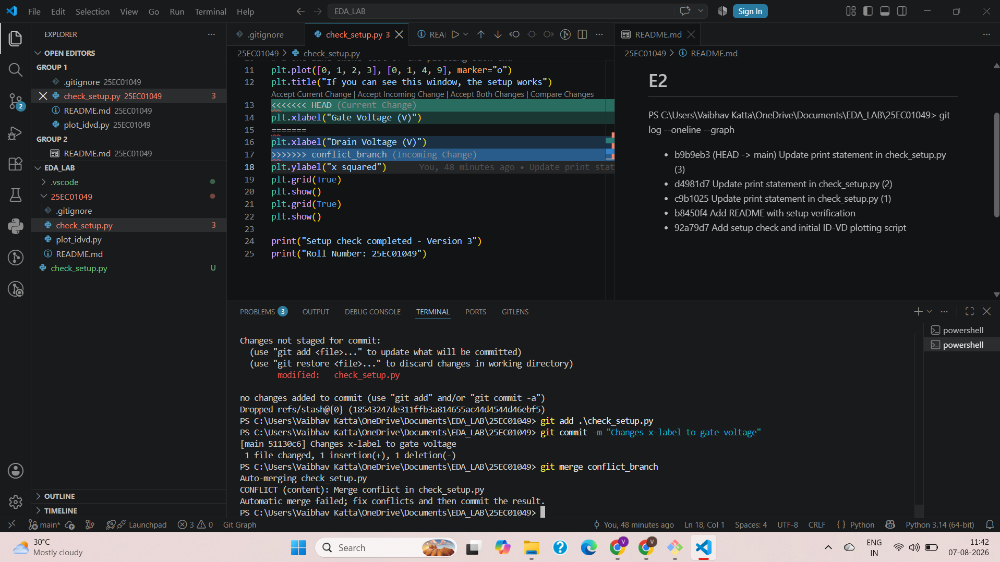
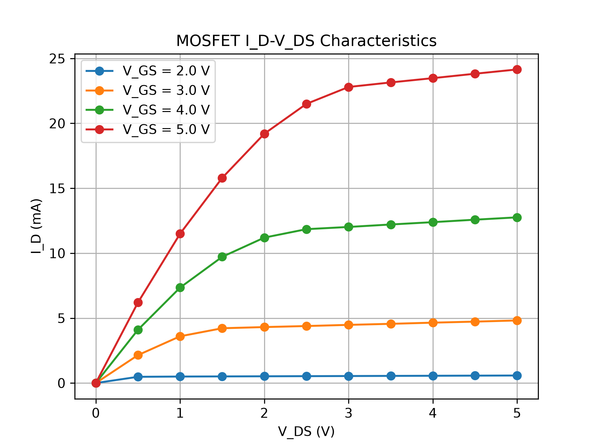
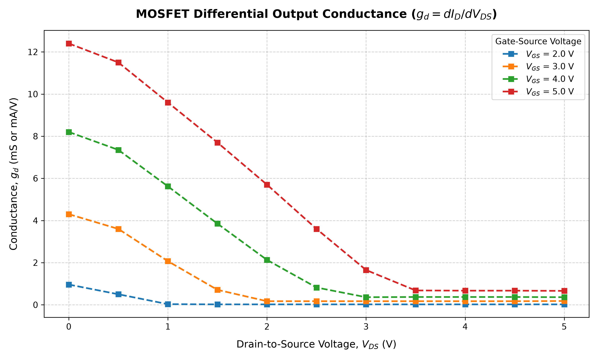
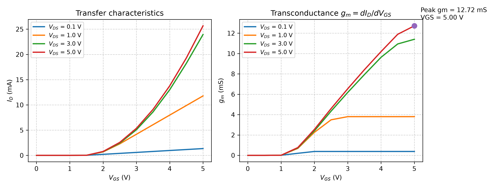
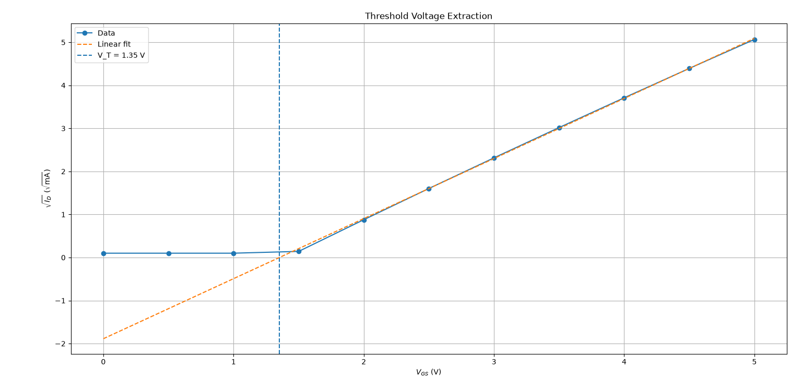
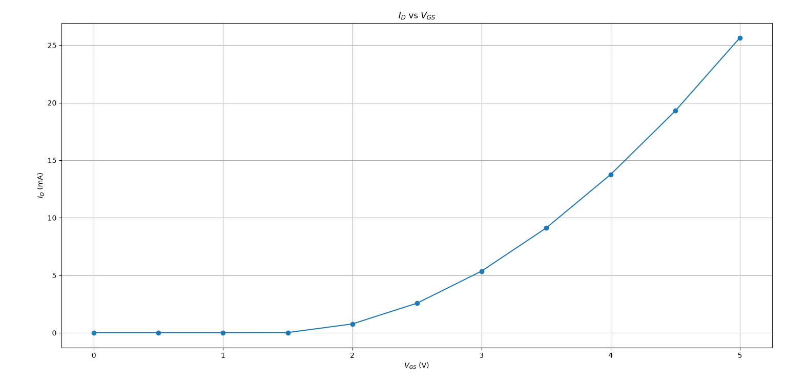

# E1
PS C:\Users\Vaibhav Katta\OneDrive\Documents\EDA_LAB\25EC01049> python check_setup.py
Python : 3.14.0
NumPy : 2.5.1
Pandas : 3.0.5
Matplotlib : 3.11.1
# E2
PS C:\Users\Vaibhav Katta\OneDrive\Documents\EDA_LAB\25EC01049> git log --oneline --graph
* b9b9eb3 (HEAD -> main) Update print statement in check_setup.py (3)
* d4981d7 Update print statement in check_setup.py (2)
* c9b1025 Update print statement in check_setup.py (1)
* b8450f4 Add README with setup verification
* 92a79d7 Add setup check and initial ID-VD plotting script
# E4

PS C:\Users\Vaibhav Katta\OneDrive\Documents\EDA_LAB\25EC01049> git log --oneline --graph --all
*   9b0455f (HEAD -> main) Resolved merge conflict in check_setup.py
|\  
| * a148c17 (conflict_branch) Change x-axis label to Drain Voltage
* | 51130c6 Changes x-label to gate voltage
|/  
* 6628b42 (branch_check) Print roll number in check_setup.py
* f1fc4d8 Add git log to README
* b9b9eb3 Update print statement in check_setup.py (3)
* d4981d7 Update print statement in check_setup.py (2)
* c9b1025 Update print statement in check_setup.py (1)
* b8450f4 Add README with setup verification
* 92a79d7 Add setup check and initial ID-VD plotting script
# E5
06f10b2 - Added DOB
# E6
PS C:\Users\Vaibhav Katta\OneDrive\Documents\EDA_LAB\25EC01049> python .\read_data.py
Columns:
['V_GS (V)', 'V_DS (V)', 'I_D (mA)']

Shape:
(44, 3)

Description:
       V_GS (V)   V_DS (V)   I_D (mA)
count  44.00000  44.000000  44.000000
mean    3.50000   2.500000   7.841591
std     1.13096   1.599418   7.904722
min     2.00000   0.000000   0.000000
25%     2.75000   1.000000   0.557500
50%     3.50000   2.500000   4.605000
75%     4.25000   4.000000  12.255000
max     5.00000   5.000000  24.150000g
# E7

## MOSFET ID-VDS Characteristics

Loaded the MOSFET CSV data using pandas and plotted the
ID-VDS characteristics for different VGS values.

The plot shows ID on the y-axis and VDS on the x-axis for
VGS = 2 V, 3 V, 4 V and 5 V.

### Output

# E8
## Differential Output Conductance

The differential output conductance was calculated using:
g_d = dI_D / dV_DS
using `np.gradient()` for the numerical derivative.

The conductance was plotted for different V_GS values.

For the highest V_Gs = 5V, the ouput conductance almost saturated V_DS = 3.5V and g_d=0.65mS and r=1/g_d
output resistance r  =  1.5 k(ohms)

### Output

# E9
# E9
## Transconductance

The transfer characteristics was plotted for different values of V_DS .
The transconductance was calculated using:
g_m = dI_D / dV_GS using np.gradient().

The peak transconductance was found to be 12.72 mS at V_GS = 5.0 V.

### Output

# E10
## Q10 – Threshold Voltage Extraction

### Observation

For V_DS = 5 V, the drain current I_D was found to be very small at low V_GS, showing that the MOSFET is below threshold. As V_GS increases beyond the threshold region, I_D increases suddenly.

The plot of √I_D versus V_GS shows an approximately linear region at higher V_GS. A linear fit was performed using this region and extrapolated to √I_D = 0. The x-intercept gives the threshold voltage:

V_T ≈ 1.35 V

The I_D versus V_GS plot also shows the expected increase in drain current after the threshold voltage is reached.

### Plots

#### √I_D vs V_GS – Linear Extrapolation

#### I_D vs V_GS

